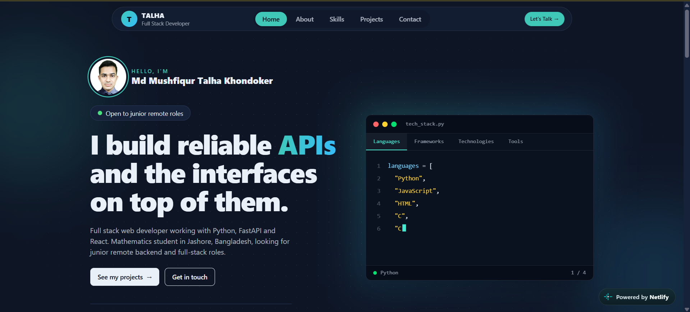

# Talha Khondoker | Portfolio

Personal portfolio website of **Md Mushfiqur Talha Khondoker**, a full stack web developer working with Python, FastAPI and React.

**Live site:** https://talha-khondoker-portfolio.netlify.app/



## About this project

A responsive, single-page portfolio that presents my projects, skills, problem-solving profiles and education. All content lives in one data file, so adding a project or a skill takes one small edit and no component changes.

## Features

- Responsive layout for phones, tablets, laptops and large screens
- Floating navbar that hides when scrolling down and returns when scrolling up or moving the mouse to the top
- Scroll progress line and highlighting of the section currently in view
- Hero section with an animated code-editor card that types out my tech stack
- Featured project cards with live demo and GitHub links
- Problem-solving section linking to my Codeforces, CodeChef and LeetCode profiles
- Light and dark themes that follow the visitor's system setting
- Contact form that opens the visitor's email app with the message filled in (no backend needed)
- Respects the "reduce motion" accessibility setting

## Built with

- [React](https://react.dev/) with [Vite](https://vite.dev/)
- [Tailwind CSS](https://tailwindcss.com/)
- [DaisyUI](https://daisyui.com/)
- Deployed on [Netlify](https://www.netlify.com/)

## Project structure

```
portfolio/
├── public/                 # Photo, resume PDF, favicon, screenshots
├── src/
│   ├── components/
│   │   ├── Navbar.jsx
│   │   ├── Hero.jsx
│   │   ├── Projects.jsx
│   │   ├── Skills.jsx
│   │   ├── ProblemSolving.jsx
│   │   ├── About.jsx
│   │   └── Contact.jsx
│   ├── Data.js             # All portfolio content lives here
│   ├── App.jsx
│   ├── main.jsx
│   └── index.css           # Tailwind, DaisyUI and theme colors
├── index.html
└── package.json
```

## Run it locally

You need [Node.js](https://nodejs.org/) 20 or newer.

```bash
# 1. Clone the repository
git clone https://github.com/talha-khondoker/portfolio.git
cd portfolio

# 2. Install dependencies
npm install

# 3. Start the development server
npm run dev
```

Then open the address shown in the terminal, usually `http://localhost:5173`.

To create a production build:

```bash
npm run build
npm run preview
```

## Customize it

All content is in `src/Data.js`:

| Export | What it controls |
| --- | --- |
| `skills` | Skill groups shown in the hero editor and the Skills section |
| `projects` | Project cards (the first one is shown as the featured project) |
| `codingProfiles` | Problem-solving cards and their profile links |
| `education` | Education timeline in the About section |

To add a project, add one object to the `projects` array:

```js
{
  title: 'Project name',
  description: 'One or two sentences about what it does.',
  points: ['What I built', 'Another highlight'],
  tags: ['FastAPI', 'React'],
  demo: 'https://your-demo-link',   // or null if there is no live demo
  github: 'https://github.com/talha-khondoker/your-repo',
  image: '/project-screenshot.png', // optional, file goes in /public
}
```

Theme colors are defined in `src/index.css` under the `portfolio-light` and `portfolio-dark` themes.

## Deployment

The site is deployed on Netlify and updates automatically on every push to `main`.

- Build command: `npm run build`
- Publish directory: `dist`

## Contact

- Email: khondokertalha@gmail.com
- LinkedIn: https://linkedin.com/in/talha-khondoker
- GitHub: https://github.com/talha-khondoker